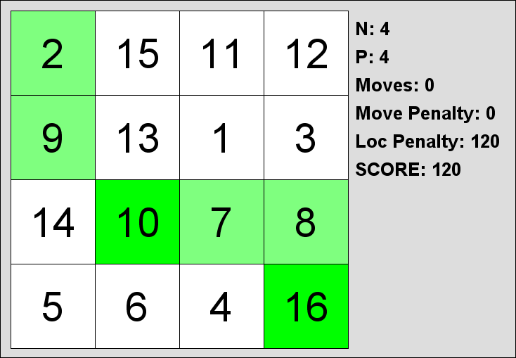

Challenege Details: https://www.topcoder.com/challenges/30122730?tab=details  
Given an NxN grid of numbers your task is to move the numbers to their target locations. A number n at row r and column c (both 0-based) is in its target location if n = r*N + c + 1. A move consists of selecting a square subgrid and rotating all its numbers by 90 degrees clockwise or counter clockwise. Rotating a subgrid of size S (2 <= S <= N) incurs a **penalty of floor((S-1)^1.5)**. A number that does not finish in its target location is penalized by P*dist, where P is a weighting input parameter and dist is the Manhattan distance to its target location. Your task is to minimize the total penalty.

  
**Learning** :  
Beam Stack Search  
Beam Search using Limited Discrepancy:  

Final state is known but we have to reduce the steps to reach to it.  
As per above papers, cases like these beam search is better approach.  

**Boltzmann constant**: If the value is too small, it cannot escape from local minimums, and if
the value is too large, it cannot converge. Need to decide the value to satisfy the both of the two constraints.  
This mainly depends on the scale of the score and how many times the SA can iterate the loop.  
However, because they are too complicated, we should change the Boltzmann constant and search the best value.  

**Beam Search Resources**  
http://hakomof.hatenablog.com/entry/2018/12/06/000000  
https://togetter.com/li/876191  
